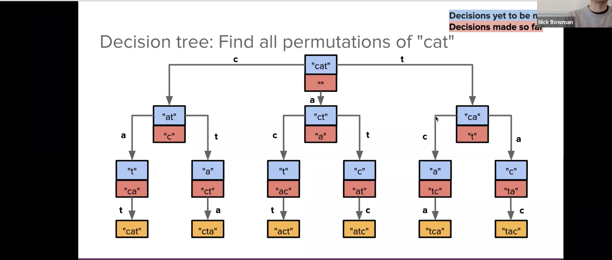

find all the permutations of a string

Base Case: No letters remaining to choose
Recursive Case: for every letter remaining, we add that letter to the current permutation and recurse

Mathematical Calculation for number of possible permutations

n!: Use this when all items are distinct, with no repetitions.

        𝑛! / 𝑛1! × 𝑛2! × ⋯ × 𝑛𝑘!

Use this when there are repeated items in the set, to account for the identical permutations.

## Explanation:

n is the total number of items in the set (including repetitions).
𝑛1 ,𝑛2, … , 𝑛𝑘, represent the **frequencies** of the distinct elements in the set.

Example:
Consider the string "AAB":

Total characters (n): 3 (two A's and one B)
Frequency of A: 2
Frequency of B: 1

Using the formula:

𝑃(𝑛) =    3! / 2! × 1! = 6 / 2 = 3

So, there are 3 unique permutations of the string "AAB": "AAB", "ABA", "BAA".