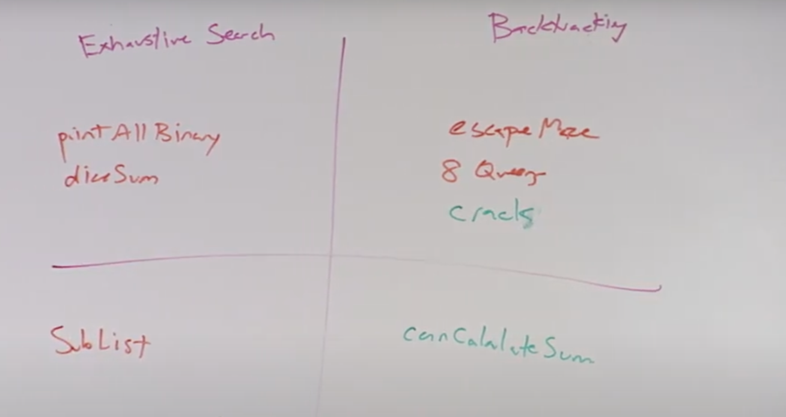

# backtracing algorithms

usually backtracking questions or algorithms are categorized as :

- Permutations
  - order matters in permutations
  - This questions can be either exhaustive searches or true backtracking

- Combinations / Subsets
  - order does not matter

recursion:

- base case
- recursive case
  - choose
  - explore
  - un-choose