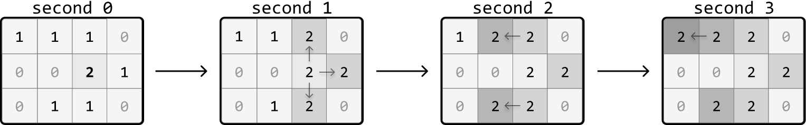

You are given a matrix where each cell is either:

0: Empty
1: Uninfected
2: Infected

With each passing second, every infected cell (2) infects its uninfected neighboring cells (1) that are 4-directionally adjacent. Determine the number of seconds required for all uninfected cells to become infected. If this is impossible, return ‐1.

Example:

Input: matrix = [[1, 1, 1, 0], [0, 0, 2, 1], [0, 1, 1, 0]]
Output: 3

