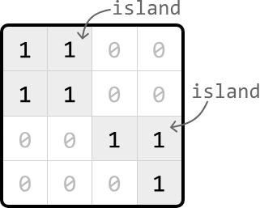

Given a binary matrix representing 1s as land and 0s as water, return the number of islands.

An island is formed by connecting adjacent lands 4-directionally (up, down, left, and right).

Example:
****