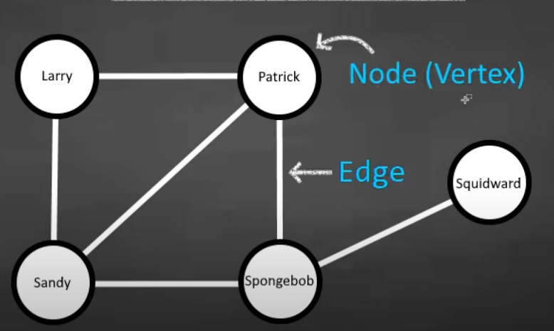
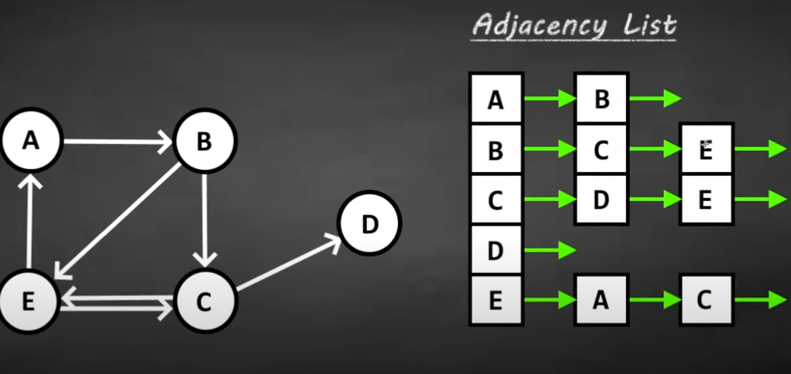
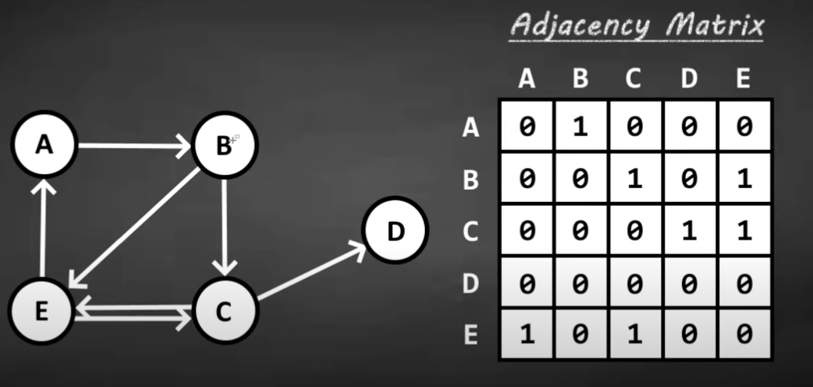

## Grpahs

Graph is a data structure composed of nodes (Vertices) connected by edges.
Graphs are used to model relationships, where the edges are the relationships



Terminologies:

**Adjacent nodes / neighbor**: two nodes are adjacent if there is an edge connecting them

**Degree:** the number of edges connected to a node

**Path:**  a sequence of nodes connected by edges

## Graph Types

- Direct vs Undirected:
  
  in a directed graph edges have a direction associated with them, while undirected graphs do not have direction associated rather the edge applies both ways.

  e.g. 
    undirected graph : social network

    directed graph:  street map where points in a map are connected with roads that are one way or 2 way direction roads. or web crawlers  representing web pages and hyper links, where edges indicate links from one page to another. another example dependencies in software packages

| Feature             | Directed Graph       | Undirected Graph                      |
|---------------------|----------------------|---------------------------------------|
| **Edge Direction **     | One-way              | Two-way                               |
| **Edge Representation** | A → B                | A — B                                 |
| **Symmetry**            | Non-symmetric        | Symmetric                             |
| **Use Cases  **         | Road maps, workflows | Social networks, physical connections |

- Weighted vs unWeighted:
  
  In a weighted graph , edges have a weight associated with them such as distance or cost


| **Feature**            | **Weighted Graphs**                                      | **Unweighted Graphs**                              |
|-------------------------|---------------------------------------------------------|---------------------------------------------------|
| **Definition**          | Edges have weights representing measurable properties.  | Edges indicate connections without measurable properties. |
| **Examples**            | Road maps, logistics, recommendation systems.           | Social networks, file systems, educational prerequisites. |
| **Use Case Focus**      | Optimizing paths, costs, or resources.                  | Analyzing connectivity or relationships.          |
| **Graph Representation**| `{ A: [{ B: 10 }, { C: 15 }] }`                         | `{ A: ["B", "C"] }`                               |


- Cyclic vs acyclic:

  A cyclic graph contains at least one cycle , which is a path that starts and ends at the same

| **Feature**              | **Cyclic Graphs**                                 | **Acyclic Graphs**                                |
|--------------------------|--------------------------------------------------|--------------------------------------------------|
| **Definition**           | Contains at least one cycle (a loop).            | Contains no cycles.                              |
| **Examples**             | Road networks, social networks, electrical circuits. | Family trees, task scheduling, data pipelines.   |
| **Common Use Cases**     | Modeling mutual relationships or loops.           | Representing dependencies or hierarchies.        |
| **Representation**       | `{ A: ["B"], B: ["C"], C: ["A"] }`                | `{ A: ["B"], B: ["C"], C: [] }`                  |


## How do we represent Graphs in Programming:

The two ost common representation of a graph are adjacency list and adjacency matrix

1. **Adjacency List:**


The neighbors for each node are stored as a list, adjacency lists can be implemented using
a hash map, where the key represents a node and its corresponding value represents the list of the node's neighbors.

Time Complexity to fin an Edge : O(Vertices)
Space Complexity: O(Vertices+Edges)

```ts
type Graph = Record<string, string[]>;

const graph: Graph = {
  A: ["B", "C"],
  B: ["A", "D"],
  C: ["A", "D"],
  D: ["B", "C"],
};

// Accessing neighbors of a node
console.log(graph["A"]); // Output: ["B", "C"]
```

When to use:

- Sparse graphs (fewer edges).
- Efficient traversal (DFS/BFS).


2. **Adjacency Matrix:**



An adjacency matrix is a 2D array where rows and columns represent vertices, and cell values indicate whether an edge exists., 
if the value is 1 it means there is an edge and if the value is 0 it means there are no edges

Time Complexity ot Locate an Edge: O(1) 

Space Complexity: O(Vertices^2)

suits to store graphs that have a lot of edges

```ts
const graph: number[][] = [
  [0, 1, 1, 0], // A -> B, C
  [1, 0, 0, 1], // B -> A, D
  [1, 0, 0, 1], // C -> A, D
  [0, 1, 1, 0], // D -> B, C
];

// Accessing if an edge exists between A (0) and C (2)
console.log(graph[0][2]); // Output: 1 (Edge exists)
```

When to Use:

- Dense graphs (more edges).
- Efficient edge lookup (constant time).


3. **Edge List:**

An edge list is a list of all edges in the graph, often represented as tuples of connected vertices.

```ts
type Edge = [string, string];
const graph: Edge[] = [
  ["A", "B"],
  ["A", "C"],
  ["B", "D"],
  ["C", "D"],
];

// Checking if an edge exists
const hasEdge = graph.some(edge => edge[0] === "A" && edge[1] === "C");
console.log(hasEdge); // Output: true
```


When to Use:
 - Graph algorithms that operate directly on edges (e.g., Kruskal’s algorithm).
 - Space efficiency for graphs with specific edge-centric operations.

| **Representation**    | **Storage Complexity** | **Edge Lookup Complexity** | **Iteration Complexity** | **When to Use**                          |
|------------------------|-------------------------|-----------------------------|---------------------------|------------------------------------------|
| **Adjacency List**     | O(V + E)               | O(V)                        | O(V + E)                  | Best for sparse graphs with many vertices but few edges. |
| **Adjacency Matrix**   | O(V²)                  | O(1)                        | O(V²)                     | Best for dense graphs with frequent edge lookups.         |
| **Edge List**          | O(E)                   | O(E)                        | O(E)                      | Best for algorithms that work directly on edges (e.g., Kruskal's). |


| **Feature**             | **Adjacency List**                 | **Adjacency Matrix**            | **Edge List**                  |
|--------------------------|------------------------------------|----------------------------------|--------------------------------|
| **Storage Complexity**  | O(V + E)                          | O(V²)                           | O(E)                          |
| **Edge Removal**         | O(V)                              | O(1)                            | O(E)                          |
| **Node Removal**         | O(V + E)                          | O(V²)                           | O(E)                          |
| **Best Use Case**        | Sparse graphs                     | Dense graphs                    | Edge-centric operations        |